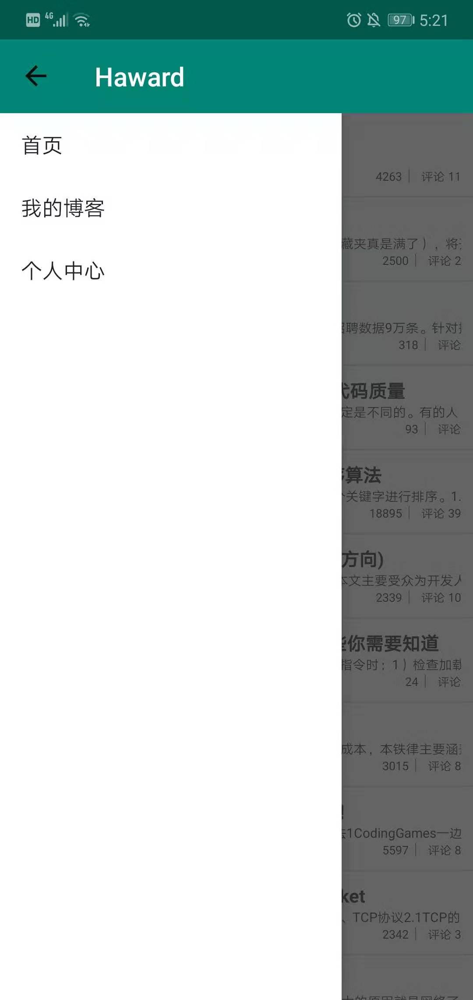
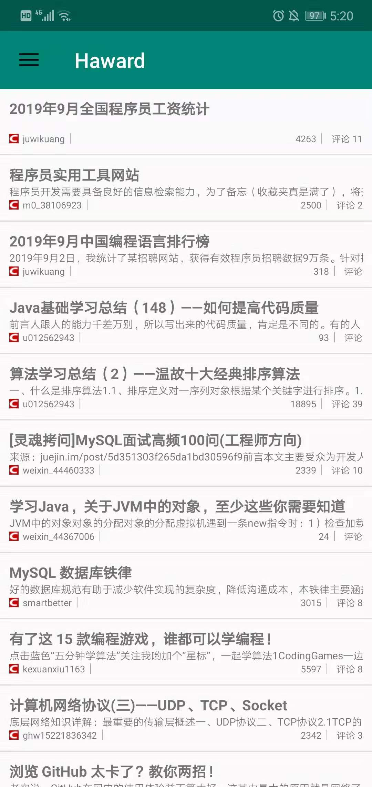
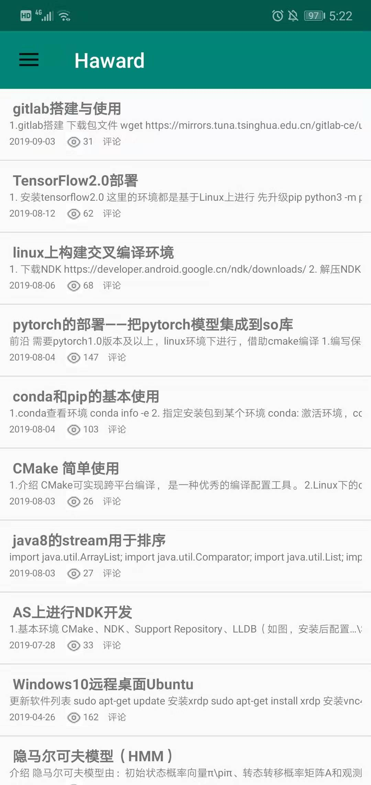
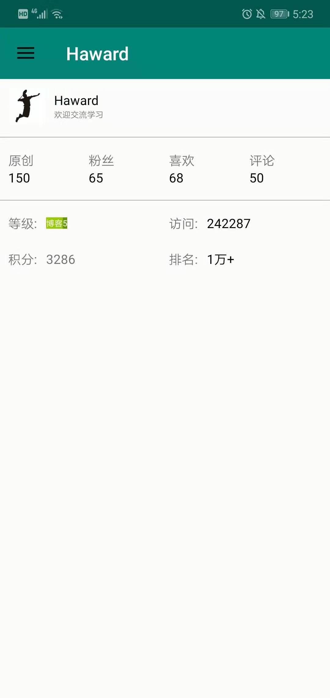
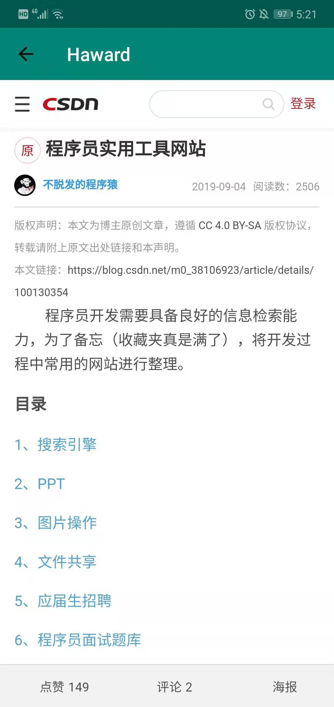
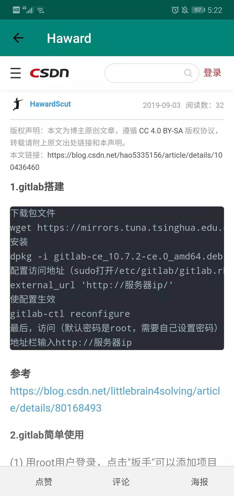

# MicroCSDNClient
## 微型CSDN技术博客客户端介绍
https://blog.csdn.net/hao5335156

该客户端为个人CSDN技术博客网页版的微型客户端APP,主要提供了以下功能：

（1）CSDN热点博客的阅读功能

（2）个人发表的CSDN博客的实时更新，方便客户端阅读与查看

（3）个人CSDN技术博客的基本信息查看，包括实时更新的评论数，粉丝数量，积分与等级排名信息等

#### 一、导航栏页面
DrawerLayout + Fragment 实现

    

#### 二、首页（CSDN博客推荐列表）
RecyclerView + 自定义RecyclerViewAdapter实现

    

#### 三、我的博客（个人博客列表）
RecyclerView + 自定义RecyclerViewAdapter实现

    

#### 四、个人中心（个人博客信息中心）
LinearLayout权重比例布局实现

    

#### 五、其他
客户端的个人博客数据由Jsoup解析,每个博客列表-item通过WebView加载对应的url

    

    

